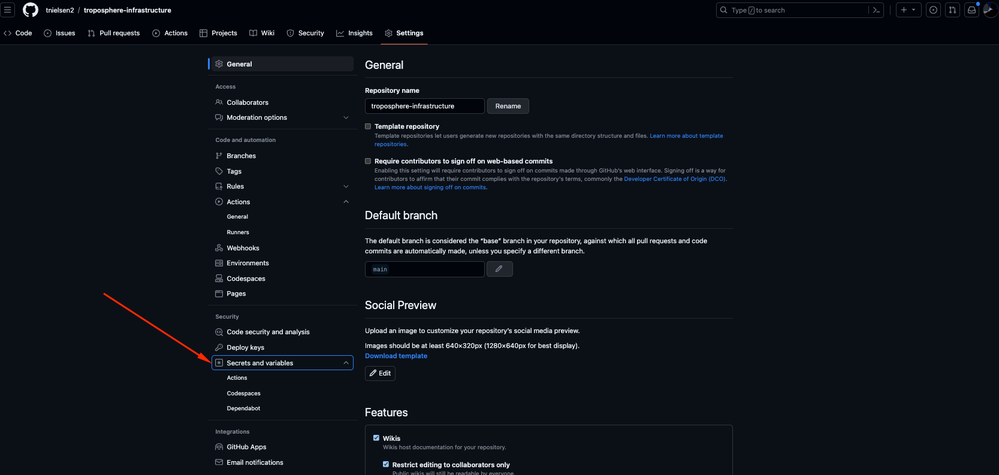
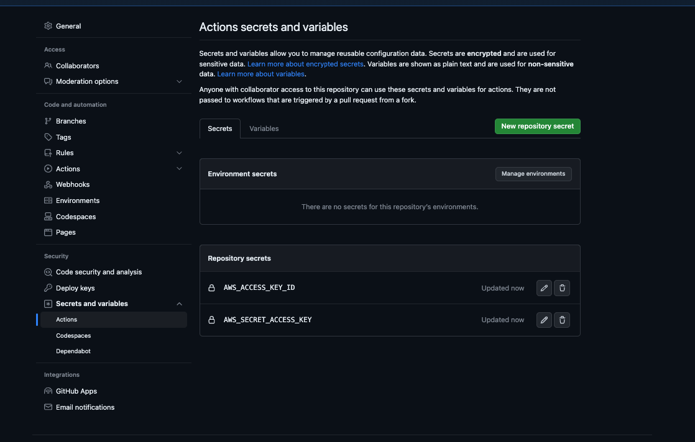

# troposphere-infrastructure
This repo is intended to house infrastructure for multiple apps and services to be used across
multiple regions and environments for a single AWS account.

Local development is configured to use a Docker image. This is to ensure that all developers are using the same
dependencies and processes within the application. 

This application uses Python to generate multiple versions of CloudFormation templates. The templates are generated
from a single Python source file, using modules and code developed alongside each source template. This allows for
scalability of CloudFormation through the means of code reuse and inheritance.

## project layout

```shell
├── .github
├── Dockerfile
├── LICENSE
├── Makefile
├── README.md
├── __main__.py
├── cfn
│   └── dev-a
│       ├── us-east-1
│       └── us-west-2
├── requirements.txt
├── src
│  ├── common
│  ├── ecs-app
│  ├── s3-static-site
│  └── vpc
└── tests
    └── cfn-lint
```
- `.gihub` - GitHub Actions workflow definitions
- `Dockerfile` - Dockerfile to build the image for local development
- `Makefile` - Makefile to execute commands for local development
- `__main__.py` - Main entrypoint for the application that generates all CFN templates from Python files
- `cfn` - Directory to store all CFN templates. The directory structure is used to determine the environment and region
  to deploy the stack to. For example, `cfn/dev-a/us-west-2/app-stack.json` will deploy the stack "app-stack" to the `dev-a`
  environment in the `us-west-2` region.
- `requirements.txt` - Python dependencies for the application
- `src` - Directory to store all Python files that generate CFN templates. Modules and configuration variables shared
  across tacks should exist in `src/common`. Each stack should have its own directory within src to indicate the stack
  name. Python objects within `common` should be named to indicate what kind of resource it is, for example `ec2.py` 
  or `rds.py`. 
- `tests` - Directory to store all tests for the application.

## Python template layout

### Global variables
Scalability of generation across regions is achieved by defaulting to a common global set of variables, but can be
overwritten on a per-stack basis. In the `src/common/global_variables.py` file, there are 2 crucial variables that
can be overwritten on a per-stack basis:
- `global_regions`
- `global_environments`

If the following variables are set within the stack's Python file, the global variables will be overwritten:
- `stack_regions`
- `stack_environments`

## Example Python template

```python
import json
# Import necessary troposphere modules as needed
from troposphere import Template, Parameter, Ref, Output, GetAtt, Join, Sub, Export
# Import modules from common that saves our templates to disk
from ..common.file_utils import save_to_file
# Import modules from common as needed
from ..common.ec2 import sg_allow_from


#### Generation vars
stack_regions = ["us-west-2"]
stack_environments = ["dev-a"]

#### Stack vars ####
app_group = "app-stack"
app_group_l = app_group.lower()
app_group_ansi = app_group_l.replace("-", "_")


#### Function that creates the stack objects for CFN generation ####
def create_cfn_template(environment, region):
    # Prepare template
    t = Template()
    t.set_description(f"{environment}: LAB - {app_group} Infrastructure")
    t.set_metadata(
        {
            "cfn-lint": {
                "config": {
                    # Do not alert for overly permissive rules, this has a dedicated VPC and no security risk
                    "ignore_checks": [
                        "W10001",
                        # Do not alert for hard coding AZs, this is fine for this use case
                        "W3010",
                    ]
                }
            }
        }
    )
    
    ### Resources ###
    
    # Load the Troposphere object into a JSON object
    json_data = json.loads(t.to_json())

    # Save the file to disk
    save_to_file(json_data, environment, region, app_group_l)
```

# Setup
1. Install Docker
2. Clone this repo
3. Set secret credentials in repo settings >> "Secrets and variables" >> Actions:


4. Add your templates in src/stack-name/template.py
5. Run `make all` to build your templates

# Usage

## Template generation
1. Add template files: src/stack-name/template.py
2. Execute, build and lint your templates `make all`

Optionally, you can execute a number of individual commands using make:

- `make all` - Runs black to lint formatting issues, cfn-lint to lint CloudFormation templates, and build your templates after building the Docker image
- `make docker` - Build the container image for your project dependencies used in subsequent commands
- `make black-fix` - Runs black to fix formatting issues, this is not part of `make all`
- `make black-lint` - Runs black to lint formatting issues
- `make cfn-lint` - Runs cfn-lint to lint CloudFormation templates.
- `make cfn-templates` - Builds your CloudFormation templates

# CI/CD
GitHub Actions is used to execute CI/CD. The workflow is defined in `.github/workflows/` directory. The workflow is
configured to lint Python and Cloudformation on every branch. If the branch is `main`, the workflow will also deploy
the stack to the appropriate environment.

## Linting
CI will validate Python and CFN-Linting and if passing, will deploy the stack to the appropriate environment. Python
Black is configured in this repo. CFN-Lint custom rules are also used, see the `tests/cfn-lint` directory for the
custom rules.

## Deployment
Only code deployed to `main` will be deployed. GitHub Actions will execute a CloudFormation `deploy` action by using 
the directory structure in the file path of the CFN payload file. For example, if you have a file in 
`cfn/dev-a/us-west-2/app-stack.json`, the stack will be deployed into the `dev-a` environment in the `us-west-2` region.

As of the development of this repo, there are no actions to automatically delete stacks. This is a manual process to
ensure safe blast radius, due to the nature of damage that can be caused. Optionally, one may want to enable termination
protection and auto delete lower environments. 

## Testing

Troposphere has validation built into it during object creation, however there may be situations where other tests
need to be added. Other than default Python Black configuration, there is no unit testing configured for this repo, but
can be easily added as desired. 
