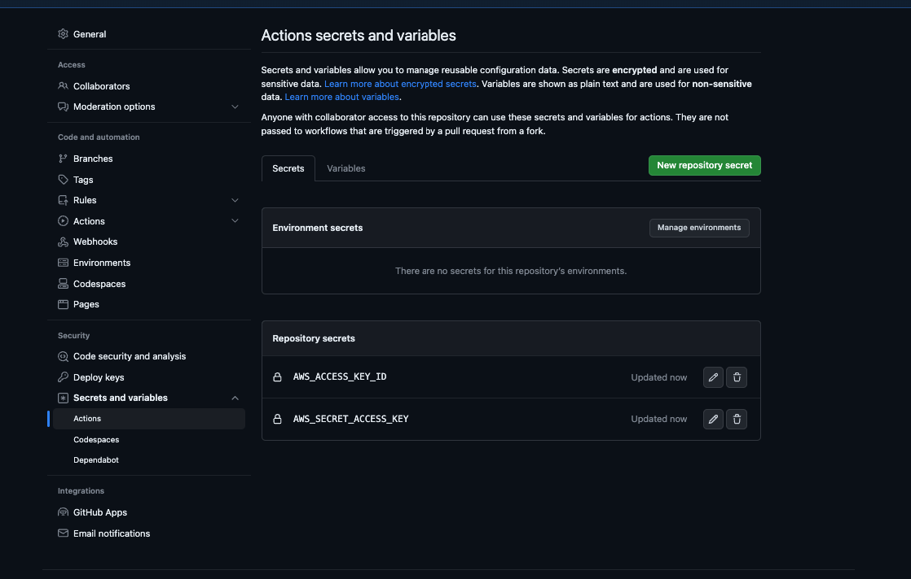

# troposphere-infrastructure
Repo to demonstrate Troposphere repo layout and scalability. Mono repo intended for a single AWS account.

# Setup
1. Install Docker
2. Set secret credentials in repo settings >> "Secrets and variables" >> Actions:

# Usage

## Template generation
1. Add template files: src/stack-name/template.py
2. Execute and build your templates `./generate-cfn.sh`